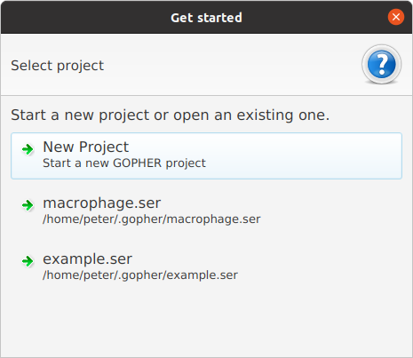

=============================
Installing and running GOPHER
=============================

~~~~~~~~~~~~
Requirements
~~~~~~~~~~~~
GOPHER needs Java 8 or newer to run.
You can determine what version of Java you have on your computer by entering the following command. ::

  $ java -version
    java version "1.8.0_144"
    Java(TM) SE Runtime Environment (build 1.8.0_144-b01)
    Java HotSpot(TM) 64-Bit Server VM (build 25.144-b01, mixed mode)

~~~~~~~~~~~~~~~~~~~~~~~~~~~~~~
Using the pre-built GOPHER app
~~~~~~~~~~~~~~~~~~~~~~~~~~~~~~
Most users should install the prebuilt application called ``GOPHER.jar`` that is available on the *Releases* section of the GOPHER GitHub repository: https://github.com/TheJacksonLaboratory/GOPHER/releases/.

On most systems you should be able to start GOPHER by double clicking on the ``GOPHER.jar``.
Alternatively, you can start ``GOPHER.jar`` from the shell with the following command. ::

  $ java -jar GOPHER.jar

**Note:** if you receive an ``OutOfMemoryError`` allow more memory to be allocated for Java heap using ``-Xmx`` option (e.g. ``java -Xmx6g -jar GOPHER.jar``)

~~~~~~~~~~~~~~~~~~~~~~~~~~~
Building GOPHER from source
~~~~~~~~~~~~~~~~~~~~~~~~~~~
It is also possible to build the GOPHER application from source.
The source code for GOPHER is available from the GOPHER GitHub page. ::

  $ git clone https://github.com/TheJacksonLaboratory/Gopher

GOPHER used the maven build system. To build the App simply enter the following command. ::

  $ mvn package

This will create the  GOPHER.jar app in the *target* subdirectory.

~~~~~~~~~~~~~~
Running GOPHER
~~~~~~~~~~~~~~
Assuming you have built or downloaded the `GOPHER.jar` file, it is simple to start the program. Enter ::

  $ java -jar GOPHER.jar

or double-click on the file.
You will see the following dialog.
This dialog allows users to open a previously created project or to start a new one.

If you click on the ``New project`` button, you can enter the desired name of the project and begin work.
Note that GOPHER stores projects files in a directory in the home directory: ``gopher``
