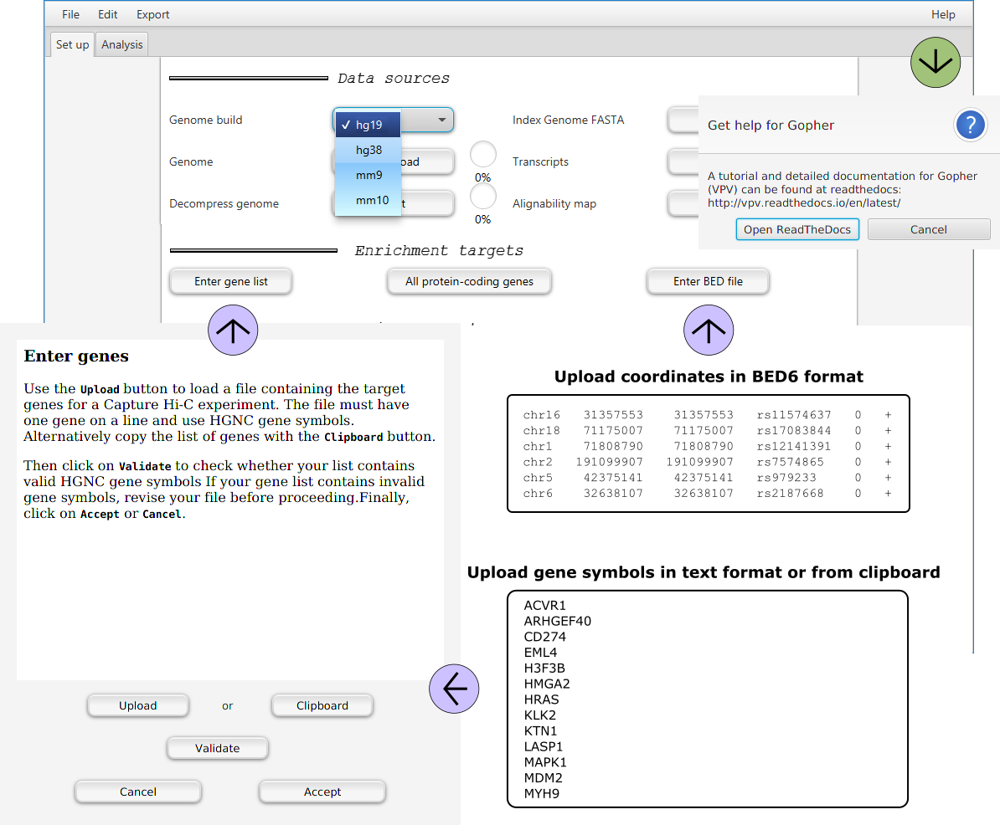
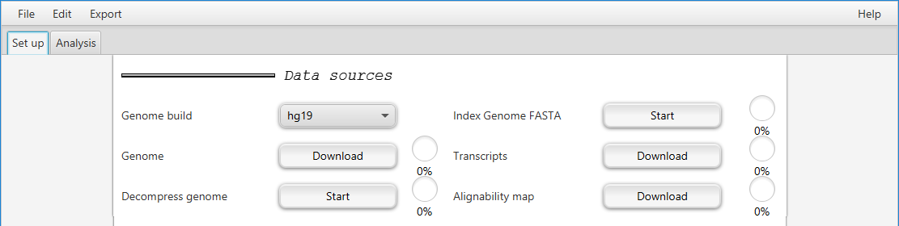
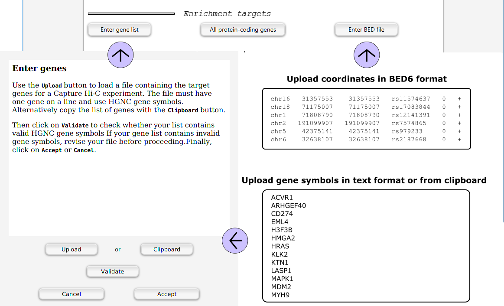
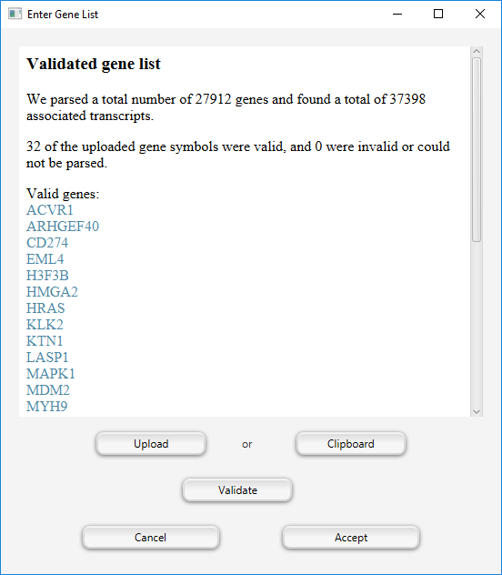

=======================
GUI -- Data preparation
=======================

~~~~~~~~
Overview
~~~~~~~~

Sequence and annotation data for various genome builds for mouse and human can be downloaded and preprocessed via mouse clicks.
Lists of target gene symbols can be uploaded from a text file or from the clipboard.
Alternatively, a shortcut allows to select all protein-coding genes as capture targets.
Gopher's functionality is not restricted to transcription start sites.
Arbitrary genomic position can be uploaded in BED6 format, for instance GWAS hits.

~~~~~~~~~~~~~~~~~~~~~~~
Choosing a genome build
~~~~~~~~~~~~~~~~~~~~~~~

GOPHER currently supports hg19 (i.e., GRCh37), GRCh38, mm9 and mm10. 
Choose the appropriate genome build from the pulldown menu.

Click on the ``Download`` button and choose a directory for the **genome**.
GOPHER will download the corresponding genome file from the UCSC Genome Browser unless it finds the correspding files in the directory, in which case it will merely show the *Done* mark.
Note that the full download may take many minutes or longer depending on your network bandwidth.

The UCSC Genome files are provided as compressed (gzip) tar archives.
Clicking on the ``Start`` button after **Decompress genome** will decompress the files if necessary.
If GOPHER finds the unpacked files in the genome directory, it will show the *Done* mark immediately.

The genome FASTA files (one for each chromosome) need to be **indexed**.
GOPHER indexes the files to produce ``.fai`` index files that are equivalent to those produced by samtools.
If desired you can use samtools yourself.
If GOPHER finds the ``.fai`` files in the directory, it will show the *Done* mark immediately.

GOPHER additionally requires a transcript definition file.
It will automatically download the correct file from UCSC if the user clicks on the ``Download`` button after **Transcripts**.
It is recommended to store the file in the same directory as the genome file.
If GOPHER finds the file in the direcotry (``refGene.txt.gz``) it will show the *Done* mark immediately.

Finally, GOPHER needs to download the alignabilty map from UCSC.
For a given kmer size :math:`k`, the alignabilty map :math:`p \mapsto a_k(p)` indicates how often the kmer starting at position :math:`p` occurs within in the entire genome. 
GOPHER will automatically download the it correct file from UCSC if the user clicks on the ``Download`` button after **Alignabilty map**.

~~~~~~~~~~~~~~~~~~~~~~~~~~~
Choosing enrichment targets
~~~~~~~~~~~~~~~~~~~~~~~~~~~

Following the steps described above, the user specifies the desired enrichment targets. 

Clicking on the ``Enter gene list`` button will open a dialog to enter a **gene list**. 
Currently, GOPHER expects a list of valid (HGNC) gene symbols. 
For promoter CHC, gene symbols can be uploaded either from a text file or from the clipboard.
Use the ``Upload`` or ``Clipboard`` buttons. 

Next, click the ``Validate`` button. 
If gene symbols are used that do not occur in the downloaded annotation data, Gopher will issue a warning and report a list of unmappable symbols that can be used to search for the current correct symbols.
Finally, click the ``Accept`` button.

Alternatively, the ``All protein-coding genes`` button allows promoters of **all-protein coding genes** to be selected as targets.

Gopher also accepts a **BED file** with genomic positions.
For instance, the coordinates of GWAS hits can be uploaded in BED6 format.
Click the ``Enter BED file`` button and select the file.

GOPHER also has two **sample gene lists** for human and mouse genomes that can be used as enrichment targets. 
To access the lists, click on ``Help > Example gene sets``. 
Select ``human`` or ``mouse`` and click ``Validate`` and ``Accept``.

