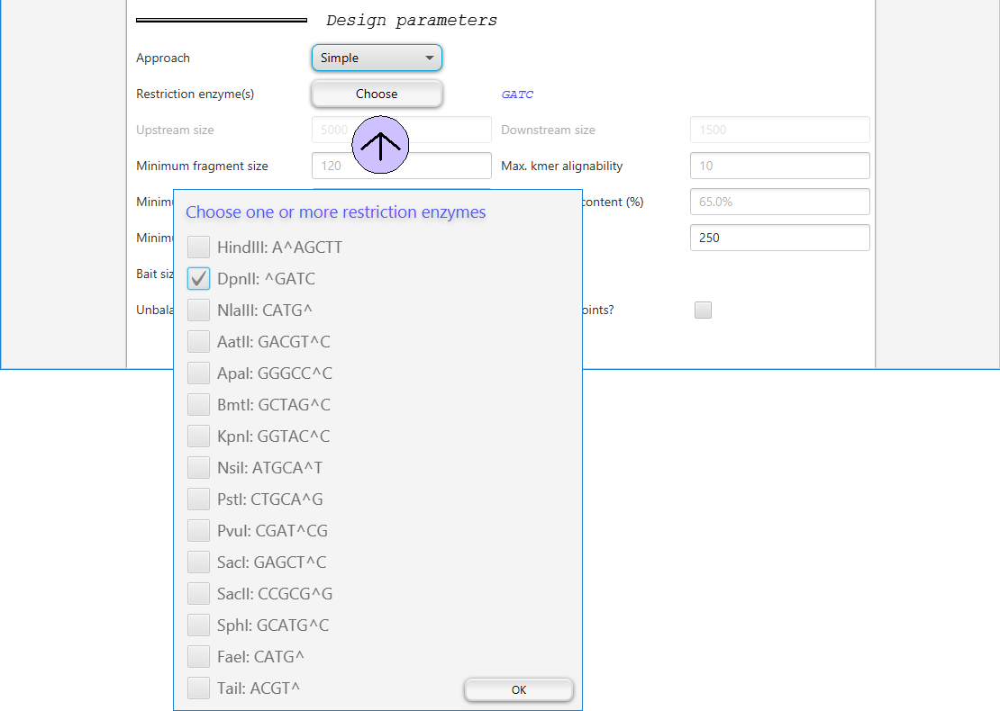
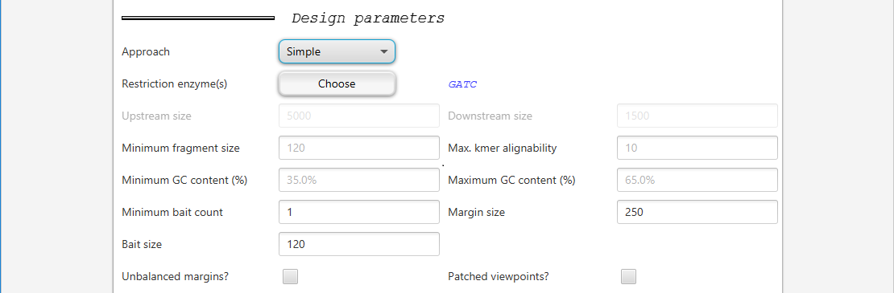
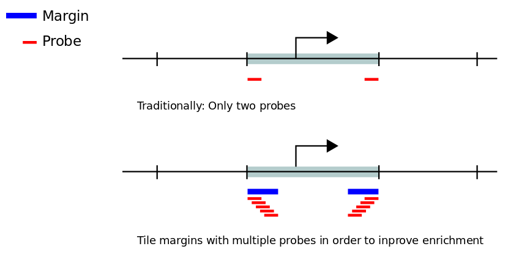
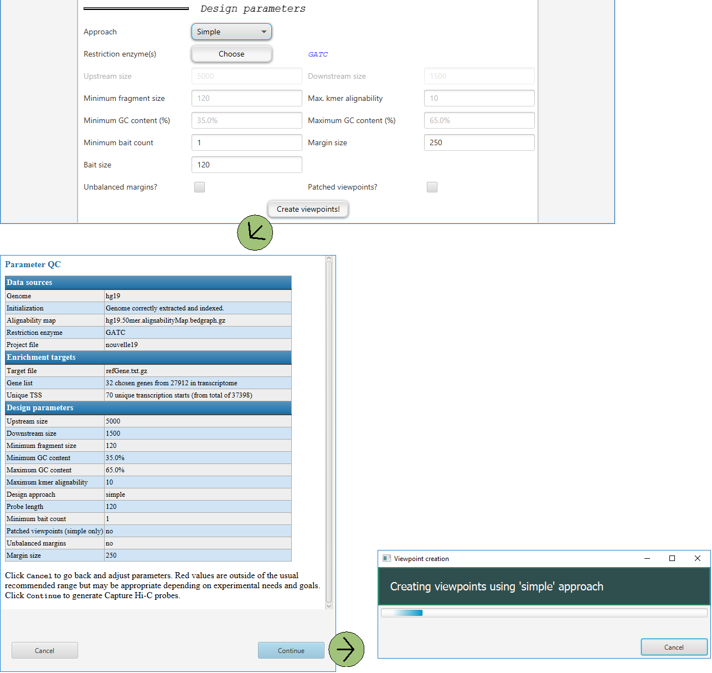

===================
GUI -- Design setup
===================

~~~~~~~~
Overview
~~~~~~~~

These are settings that determine how the panel design will be performed. Users should understand the requirements of
the probe manufacturer and choose settings that match them.

..
  GOPHER will search for fragments for each transcription start site (TSS) of the genes selected in the .
  GOPHER will search for fragments located within (Upstream size) base pairs 5' ot the TSS and (Downstream size) base pairs 3' of the fragment (5' and 3' are understood with respect to the orientation of transcription of the gene).
  Fragments are allowed to overlap the upstream downstream boundaries.
  Depending on which restriction enzyme is used the upstream and downstream size have to be set appropriately.
  The default values -5000 and +1500 are suitable for DpnII, but for enzymes that produce longer fragments such as HindIII larger values should be selected.
  Fragments must have a certain minimum size to be efficiently enriched in capure Hi-C.
  120 nucleotides is a good default value for current capture technologies.
  Additionally, fragments must not exceed a certain repeat content and must have a GC content that lies within a certain range to allow accurate mapping and efficient capture and sequencing.
  Current design "wizards" will not allow fragments that are outside of this range.
  GOPHER will therefore choose only those fragments that fulfil these criteria.
  Users may set these criteria to their maximum values to allow the design wizard to make the final decision on the fragments (then, all fragments within the indicate location will be chosen by GOPHER).

~~~~~~~~~~~~~~~~~~~~~~~~~~~~~
Choosing the viewpoint design
~~~~~~~~~~~~~~~~~~~~~~~~~~~~~

GOPHER implements three main strategies for probe design:

.. figure:: img/new/gui2_approaches2.png

The **simple approach** generates probes that are similar to those used for many previously published capture Hi-C studies: One fragment is designed per target region (often a transcription start site of a protein-coding gene); GOPHER can generate probes using this probe set for all transcripts of all protein-coding genes or for a user-defined gene set.

The **simple-patched approach** "patches" viewpoints that are poorly covered by single fragments in a way that can increase the number of genes with valid viewpoints.

GOPHER additionally implements a new approach to probe design that we term **extended approach** which is intended to provide greater resolution than the simple approach by selecting sets of multiple fragments per target region.

In general, the simple approach is best suited for investigations of larger numbers of targets (such as a promoterome in which all promoters of all coding genes are investigated, and the extended approach is more suited to investigate a small sample of genes (e.g., 500--1000) involved in a biological process of interest.

For more information on the different approaches, see section ":ref:`approaches`" on page "Concepts and terminology"

~~~~~~~~~~~~~~~~~~~~~~~~~~~~
Choosing restriction enzymes
~~~~~~~~~~~~~~~~~~~~~~~~~~~~

Clicking on the ``Choose`` button after **Restriction enzyme(s)** will open a dialog where the user can choose one or multipe restriction enzymes.
Obviously, you need to choose the enzymes that will be used in the captuyre Hi-C experiment.

~~~~~~~~~~~~~~~~~~~~~~~
Miscellaneous parmeters
~~~~~~~~~~~~~~~~~~~~~~~

There are various additional parameters that can be adjusted.

+----------------------------------+--------------------------------------------------------------------------------+
| Parameter                        | Explanation                                                                    |
+==================================+================================================================================+
| ``Upstream size``                | Number of base pairs upstream (5') of TSS                                      |
+----------------------------------+--------------------------------------------------------------------------------+
| ``Downstream size``              | Number of base pairs downstream (3') of TSS                                    |
+----------------------------------+--------------------------------------------------------------------------------+
| ``Minimum fragment size``        | Size threshold for choosing a restriction fragment in base pairs               |
+----------------------------------+--------------------------------------------------------------------------------+
| ``Maximum kmer alignability``    | ???                                                                            |
+----------------------------------+--------------------------------------------------------------------------------+
| ``Minimum GC content (%)``       | Minimum percentage of G and C bases in fragment                                |
+----------------------------------+--------------------------------------------------------------------------------+
| ``Maximum GC content (%)``       | Maximum percentage of G and C bases in fragment                                |
+----------------------------------+--------------------------------------------------------------------------------+
| ``Minimum bait count``           | ???                                                                            |
+----------------------------------+--------------------------------------------------------------------------------+

~~~~~~~~~
Bait size
~~~~~~~~~

``Bait size`` should be set according to the length that will be ordered from the manufacturer.
A typical value is 120 bp (this is the default in GOPHER).

~~~~~~~~~~~
Margin size
~~~~~~~~~~~

``Margin size`` defines the width of the targeted regions at the outermost ends of restriction fragments that are earmarked to be tiled with probes.
Margin size refers to the average size of the edge (margin) of the restriction fragments that remain after the fragmentation (sonication) step of the Capture Hi-C protocol.

For instance, if a restriction fragment is 1000 bp long directly after restriction enzyme digestion, sonication may further fragment this segment of DNA into two or more smaller fragments, and the fragment that is attached to the biotin marker will be enriched.
The baits are therefore typically designed to hybridize to the margins (and not to the center) of the restriction fragments.

The margin size parameter should thus be set according to the expected experimental fragmentation size.
We have found that 250 bp is a good starting point, and this value is the default in GOPHER.

~~~~~~~~~~~~~~~~~~~
Unbalanced margins?
~~~~~~~~~~~~~~~~~~~

For some capture Hi-C design strategies, only two probes (or baits) are placed at the outermost ends of restriction fragments that are ought to be enriched.
Enrichment and sequencing in capture Hi-C experiments effectively is concentrated in the margins of the fragments as defined above.
Typcically, fragments whose margins have a too high repeat content or that have a too high or too low GC content are difficult to enrich and sequence and are therefore excluded from probe designs.

In many cases, however, one of the two ends of a fragment may satisfy repeat and GC criteria, while the other end does not.
GOPHER allows users to choose whether both ends of a fragment must satisfy these criteria (``Unbalanced margins?`` *unchecked*), or whether all fragments are chosen for which at least one of the ends satisfies the criteria (``Unbalanced margins?`` *checked*).

~~~~~~~~~~~~~~~~~~~
Creating viewpoints
~~~~~~~~~~~~~~~~~~~

Clicking on ``Create viewpoints!`` will open a dialog in which the user can review the parameters for the current project and click on cancel to change parameters or Continue to go ahead with the analysis. Once the analysis is started, a progress dialog will be shown.

