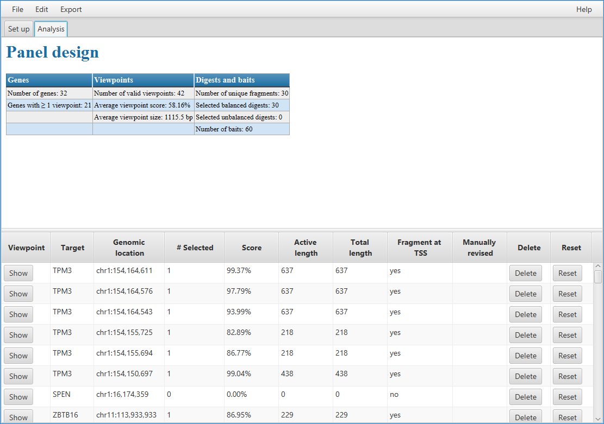
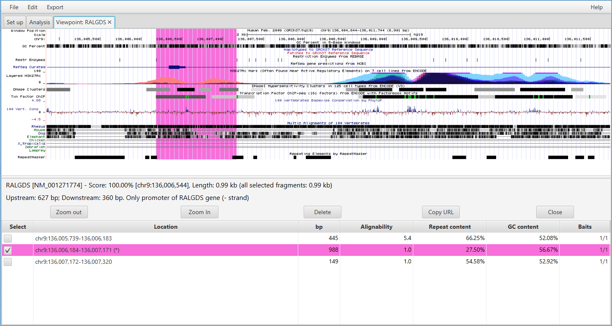
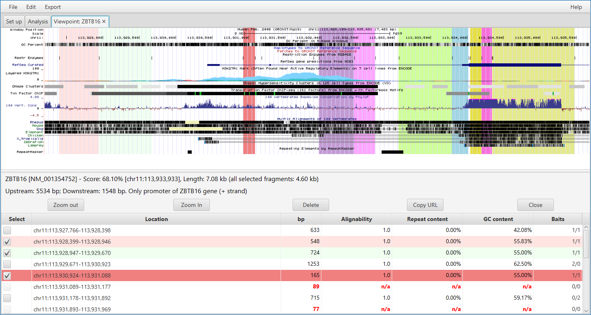
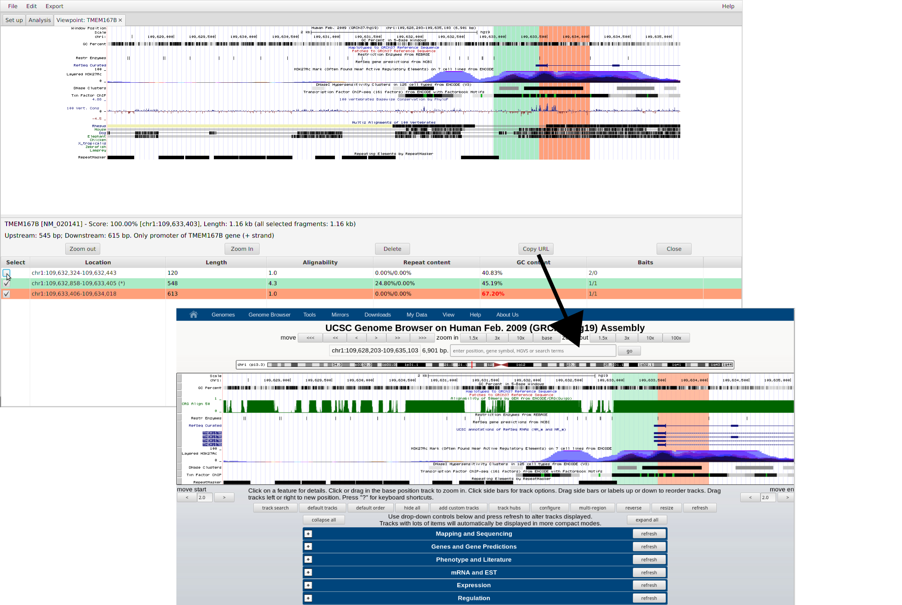

=======================
GUI -- Viewpoint window
=======================

~~~~~~~~~~~~~~~
Analysis window
~~~~~~~~~~~~~~~

In this tab a summary of the viewpoint creation is shown.
At the top global summary statistics regarding the entire design are listed, such as the number of genes and viewpoints.
Note that there are usually more viewpoints than genes, because one viewpoint for each TSS is created.
GOPHER shows viewpoints for which no fragments could be found to allow the user to manually review them and add Fragments by hand if desired.

The table below contains detailed information about each individual viewpoint.
A score is calculated for each viewpoint as described in the main manuscript.
Furthermore, there is a button for each viewpoint that opens the viewpoint tab.

~~~~~~~~~~~~~~~~~~
Editing viewpoints
~~~~~~~~~~~~~~~~~~

Each viewpoint can be inspected in a separate tab and fragments can be added or removed as desired.
GOPHER fetches information about the genomic location of the viewpoint from the UCSC Genome browser and displays this in a window.
Selected fragments are highlighted with different colors.

For the **simple approach**, viewpoints will have a single fragment if the fragment overlapping the TSS passes the selection criteria explained above.
The example below shows the promoter 2 of the RALGDS gene.

For the **extended approach**, promoters can have multiple fragments.
In the following example, GOPHER has selected 7 fragments for the 5th (most 3') of five promoters of hte ZBTB16 gene.
Several of the candidate fragments were rejected because they were too small (89 nt, 77 nt, 20 nt, and 0 nt).
One 715 nt fragment was rejected because it GC content was above threshold (71.33%), and one 320 nt fragment was rejected because of a repeat content of 73.75%.
None of the reject fragments would be expected to perform well in a capture Hi-C experiment. 

~~~~~~~~~~~~~~~~~~
Zooming out and in
~~~~~~~~~~~~~~~~~~

Clicking the ``zoom out`` or ``zoom in`` buttons will expand or contract the region of the genome that is shown. 
Zooming can affect the number of fragments chosen -- zooming out will cause any new fragments in the new win dow that satisty the filter criteria to be chosen. 
On the other hand, zooming in will cause fragments that are no longer visible to be deselected.

~~~~~~~~~~~~~~~~~~~~~~~~
UCSC genome browser link
~~~~~~~~~~~~~~~~~~~~~~~~

Clicking on the ``Copy URL`` button will generate a link to continue the analysis in the UCSC genome browser.

