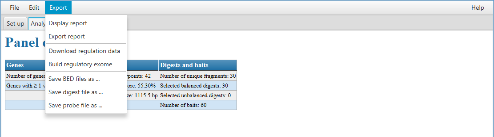

=================
Exporting results
=================

GOPHER can produce a number of different output files for different analyses.
Many users will want the BED file with the definitions of target regions that can be used to produce a capture Hi-C probe set.

.. toctree::
   :maxdepth: 1
   :caption: Contents

   bed_output
   reg_exome_output
   digest_output
   project_export
