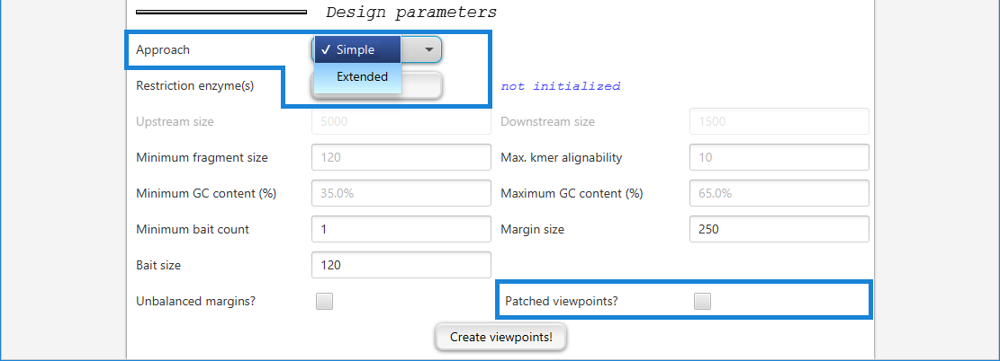
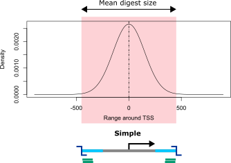
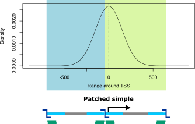
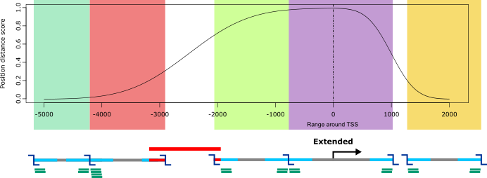

========================
Concepts and terminology
========================

~~~~~~~~~~~~~~~~~~~~~~~~~~~~
Introduction to Capture Hi-C
~~~~~~~~~~~~~~~~~~~~~~~~~~~~

Chromosome conformation capture (3C) is used to analyze the spatial structure of chromatin which plays an important role in regulation of gene expression.
The next-generation sequencing application Hi-C allows the detection of all pairwise DNA interactions within the genome.
In order to derive valid interactions, Hi-C requires a large amounts of input DNA and deep sequencing.
Similar to exome sequencing, capture Hi-C (CHC) implements a compromise by limiting the view to preselected regions of interest using hybridization capture technology.
For instance, capture Hi-C can be used to restrict the analysis to interactions that involve promoter regions.

For Hi-C **restriction enzymes** are employed that cut the genome at specific nucleotide patterns. For instance, the enzyme
DpnII cuts at all occurrences of the pattern GATC. The resulting DNA fragments are referred to as **digests**.
The resolution of Hi-C is at the digest level, i.e. detected interactions are between digests,
which is why the target regions for capture Hi-C consists of digests.
Due to the Hi-C protocol the **probes** (aka **baits**) used for enrichment should be placed within the **margins** of digests only.

Additional information can be found in a number of papers including the following:

`Mifsud B et al (2015) Mapping long-range promoter contacts in human cells with high-resolution capture Hi-C. Nat Genet. 2015 Jun;47(6):598-606 <https://www.ncbi.nlm.nih.gov/pubmed/25938943>`_

`Mishra A, Hawkins RD (2017) Three-dimensional genome architecture and emerging technologies: looping in disease. Genome Med. 2017 Sep 30;9(1):87 <https://www.ncbi.nlm.nih.gov/pubmed/28964259>`_

`Schoenfelder S et al (2018) Promoter Capture Hi-C: High-resolution, Genome-wide Profiling of Promoter Interactions. J Vis Exp. doi: 10.3791/57320. <https://www.ncbi.nlm.nih.gov/pubmed/30010637>`_

`Orlando G et al (2018). Capture Hi-C Library Generation and Analysis to Detect Chromatin Interactions. Curr Protoc Hum Genet. 2018 Jul 6:e63. <https://www.ncbi.nlm.nih.gov/pubmed/29979818>`_

.. _approaches:

~~~~~~~~~~~~~~~~~~~~~~~~~~~~~~
Approaches to viewpoint design
~~~~~~~~~~~~~~~~~~~~~~~~~~~~~~

GOPHER implements three main strategies for probe design.
To choose one of the approaches, select ``Simple`` or ``Extended`` from the pulldown menu at the top of the setup pane.
The Simple approach can be combined with the ``Patched viewpoints?`` option.

------
Simple
------

Simple viewpoints consist of only **one digest** that most typically contains the trancription start site (TSS).
The simple approach is intended for designs with large numbers of target regions such as studies of all promoters for protein coding genes.
In the first run of viewpoint creation, only the digests that contain the TSS are selected.
This typically results in inhomogeneous sets of viewpoints, i.e. numbers of covered bases vary due to different sizes of digests.
Furthermore, for some viewpoints the selected digest covers the region upstream but for others the region downstream of the TSS.

GOPHER tries to select the fragment that overlaps the transcriptional start site (TSS) and additionally satisfies the following requirements:

* GC content of the fragment is within the minimum and maximum limits defined on the setup tab
* The repeat content of the margins of a fragment is not higher than the defined limit (see below for a definition of fragment margin)
* The length of the fragment is not less than the lower boundary defined in the setup tab, and not more than 20,000 nucleotides

If the restriction fragment that overlaps the TSS does not satisfy all of these criteria, then no restriction fragment is selected.

--------------
Simple patched
--------------

Due to the uneven distribution of restriction enzyme cutting sites across the genome, it is often the case that digests are not well centered at the TSS positions.
If the **patching** of simple viewpoints is allowed, GOPHER tries to compensate for this by adding one of the adjacent digests.
The resulting viewpoints are referred to as **simple patched viewpoints** and consist of **two digests**.

For this purpose, a score for simple viewpoints was defined that corresponds to the area under the curve of a normal distribution centered at the TSS but only for those section that are covered by the selected digest.
For digests that are not well centered at the TSS this score will be close to 0.5.
By default, GOPHER performs patching for scores below 0.6.

--------
Extended
--------

For **extended viewpoints**, a range around genomic positions (most typically a TSSs) can be specified.
GOPHER tries to select all digests that overlap the specified range.
The number of digests depends on the restriction enzyme.

The extended approach is intended for in depth analyses of a few hundred predefined genes that are of interest within a given context, e.g. all genes associated with Mendelian immune diseases.
All digests that overlap the specified range and satisfy the design parameters are selected.
The score for extended viewpoints is similar to that for simple viewpoints.
The individual positions surrounding the TSS are weighted by their distance to the TSS, and only positions that are covered by selected digests contribute to the score.
This has the effect that viewpoints with a large proportion of covered positions near to the TSS will be assigned a good score, which is useful for the identification of poorly resolved viewpoints that require manual inspection.

For instance, if upstream size is set to 5000 and downstream size is set to 2000, then GOPHER will select all restriction fragments that are at least partially located within the 5000 nucleotides 5' (upstream) of the TSS and within 2000 nucleotides 3' (downstream) of the TSS.
Note that if a fragment overlaps the upstream or downstream limit by at least one nucleotide it will be chosen if the criteria are fulfiled.
The criteria for GC and repeat content are identical to those of the simple approach.

------------------------
Comparison of approaches
------------------------

+----------+-------------------------------------------------------+----------------------------------------------------------------------------------------------------------------+
|          | Advantages                                            | Disadvantages                                                                                                  |
+==========+=======================================================+================================================================================================================+
| Simple   |* Only two probes required for each viewpoint.         |* Size of target regions determined by the choice of restriction fragment.                                      |
|          |                                                       |                                                                                                                |
|          |* Applicable to a large number of target genes.        |* Many target genes have to be discarded, because TSS containing fragment cannot be enriched.                   |
+----------+-------------------------------------------------------+----------------------------------------------------------------------------------------------------------------+
| Patched  |* Potentially more efficient enrichment of fragments   |* Size of target regions determined by the choice of restriction fragment.                                      |
| simple   |  as compared to the *Simple* approach.                |* Many target genes have to be discarded, because TSS containing fragment cannot be enriched.                   |
|          |                                                       |* Applicable to a smaller number of genes, because more probes required as compared to the *Simple* approach.   |
+----------+-------------------------------------------------------+----------------------------------------------------------------------------------------------------------------+
| Extended |* Size of the target regions defined by the user.      |* Applicable to a smaller number of genes, because more probes required as compared to the *Simple+* approach.  |
|          |* Many target genes that would have been discarded can |                                                                                                                |
|          |  be *rescued* by enriching fragments next to the TSS  |                                                                                                                |
|          |  containing fragment.                                 |                                                                                                                |
+----------+-------------------------------------------------------+----------------------------------------------------------------------------------------------------------------+

~~~~~~~~~~~~
Usable baits
~~~~~~~~~~~~

Within the framework of GOPHER, a digest can only be selected if sufficient usable baits can be placed within margins.
A bait is **usable** if it satisfy constraint regarding repeat and GC content.
The uniquness of any given bait is measured as its mean **alignabilty**,
and the the **GC content** is the proportion of Gs and Cs within the bait sequence.
The user can specify thresholds for alignability and GC content.

~~~~~~~~~~~~~~~~~~~~~~~~~~~~~~~
Balanced and unbalanced margins
~~~~~~~~~~~~~~~~~~~~~~~~~~~~~~~

A **minimum number of baits** can be specified by the user.
By default, GOPHER tries to place b\ :sub:`min` in each margin of a given digest.
If this is successful the digests is referred to as **balanced**.
The constraint of balanced margins can be relaxed.
If **unbalanced** margins are allowed, GOPHER tries to place 2 times b\ :sub:`min` in both margins.
Alternatively, **unbalanced** digests can be added manually for individual viewpoints.

