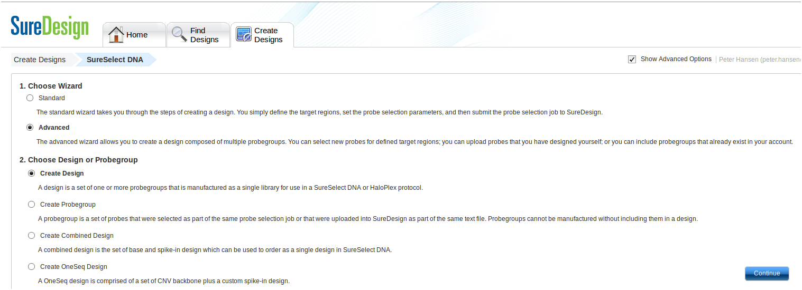
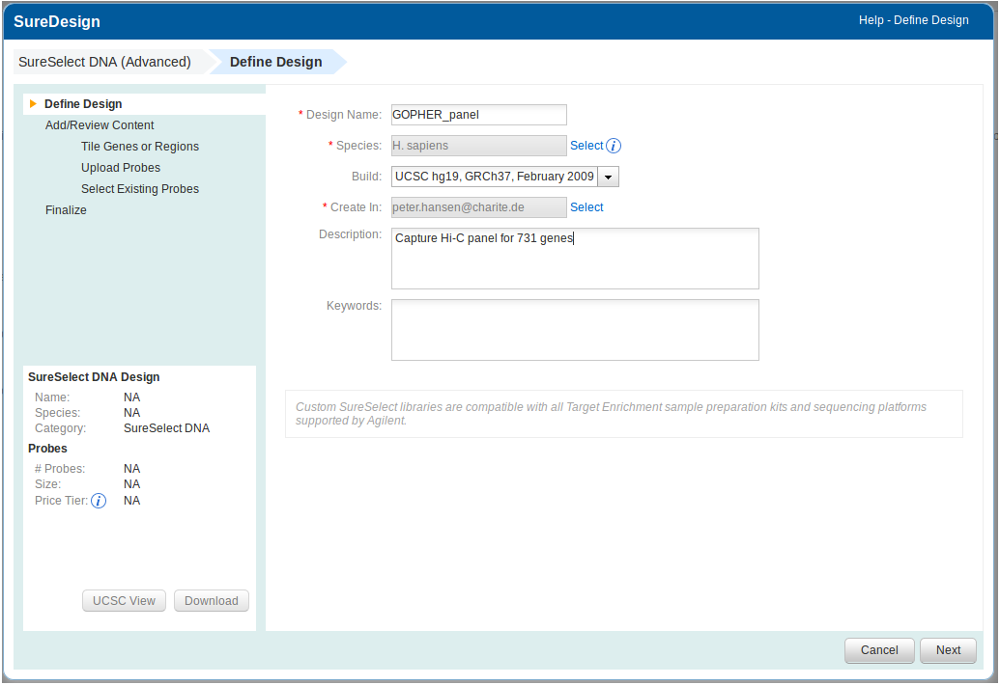
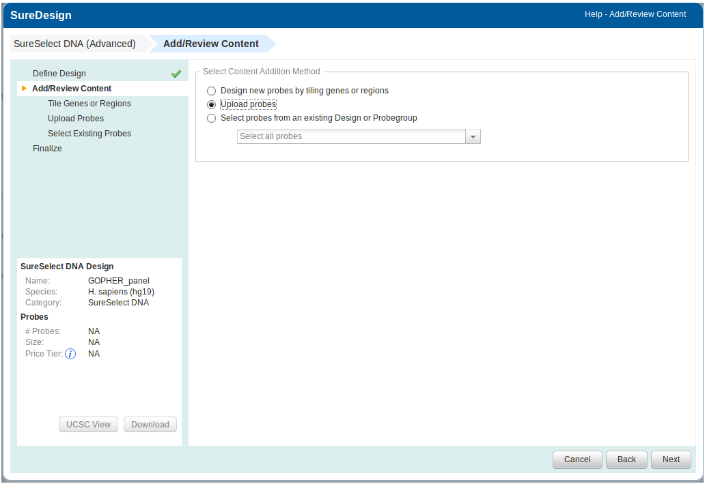
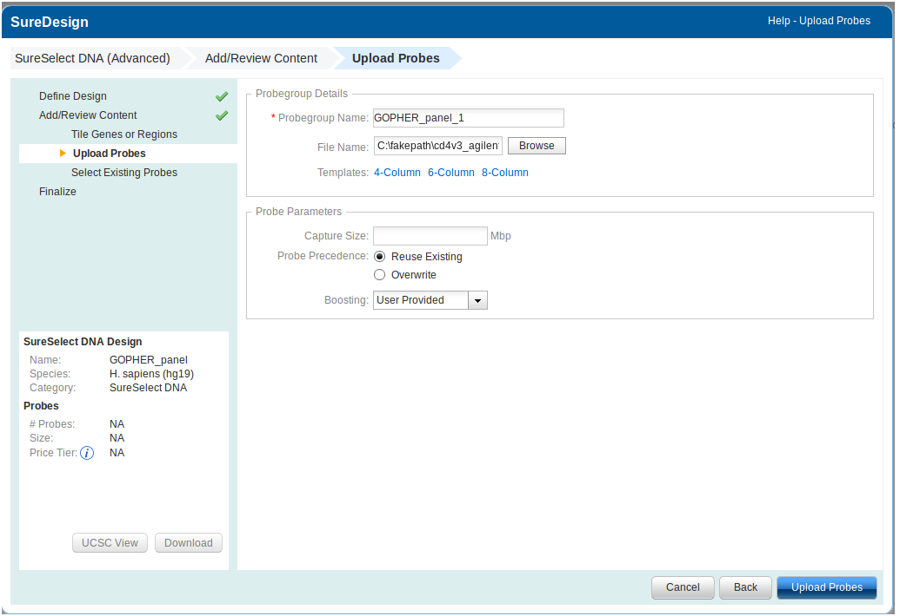
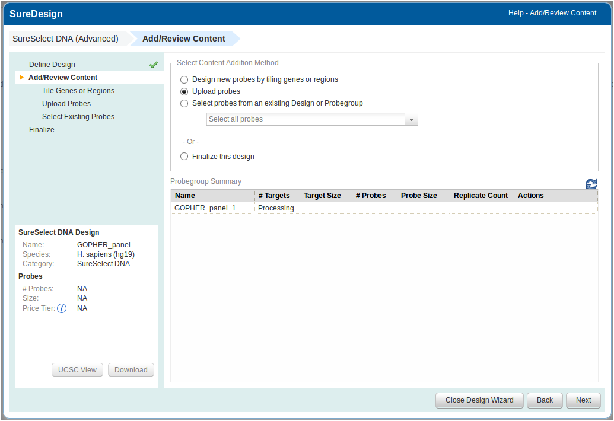
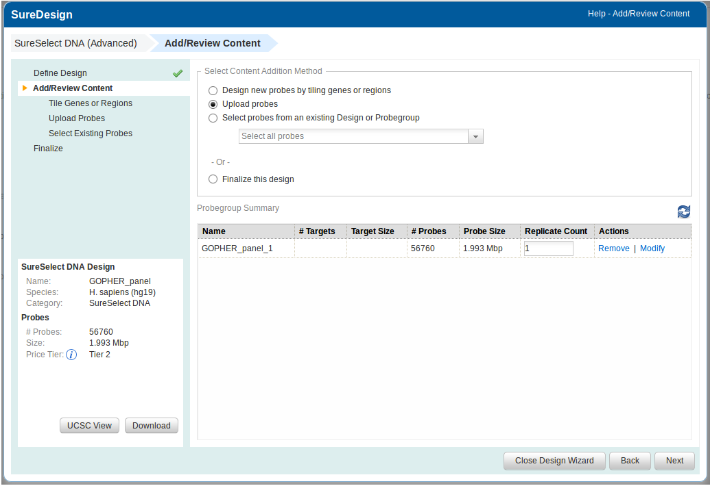
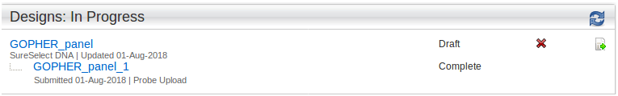

============
Probe upload
============

~~~~~~~~~~~~~~~~~~~~~~~~~~~~
Export of probes from GOPHER
~~~~~~~~~~~~~~~~~~~~~~~~~~~~

Probes can be exported from GOPHER via the **Export** menu by selecting **Save probe file as...**.

.. figure:: img/new/output_export.png

~~~~~~~~~~~~~~~~~~~~~~~~~~~~~~~~~~~~~
Upload to Agilent's SureDesign wizard
~~~~~~~~~~~~~~~~~~~~~~~~~~~~~~~~~~~~~

GOPHER exports a .zip file that contains the probes in Agilent's **6-column probe upload file** format_
and can be uploaded to SureDesign_ for ordering and production.

.. _format: https://earray.chem.agilent.com/suredesign/help/Formats_for_probe_upload_files.htm

.. _SureDesign: https://earray.chem.agilent.com/suredesign/index.htm

.. figure:: img/new/sureDesignLogin.png

After login the advanced mode needs to be activated.

.. figure:: img/new/sureDesignActivateAdvanced.png

Then select SureSelect DNA.

.. figure:: img/new/sureDesignSureSelect.png

On the next sceen select **Create Design** and click on **Continue**.

Enter a name for your design, specify appropriate **Species** and genome **Build** and click on **Next**.

On the next screen select Upload probes and click on **Next**.

On the next screen click on **Browse** and select your file containing the probes. Nothing else needs to be specified. See here_
for more detailed information. Then click on **Upload probes**.

.. _here: https://earray.chem.agilent.com/suredesign/help/SureSelect_probe_group_wizard_Add_Content_Probe_Upload.htm

Depending on the number of probes this may take some minutes.

Once the upload is completed, the number of probes are displayed. To be on the safe side, compare this number with
the number reported by GOPHER on the analysis tab. Then close the design wizard.

Back on the main screen of SureDesign the new design appears under **Designs: In Progress**. Click on the plus icon
in order to finalize the design. Finalized designs are assigned a design ID that can be used for ordering.

~~~~~~~~~~~~~~~~~~~~~~~~~
Upload to other providers
~~~~~~~~~~~~~~~~~~~~~~~~~

Currently, GOPHER exports probes only in Agilent's **6-column probe upload file**. Further output formats will be
implemented upon upon request_.

.. _request: https://github.com/TheJacksonLaboratory/Gopher/issues
